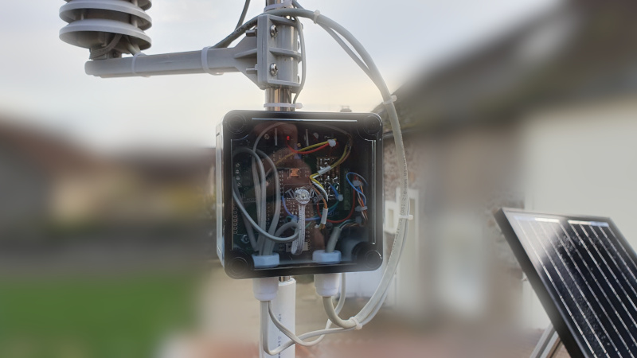
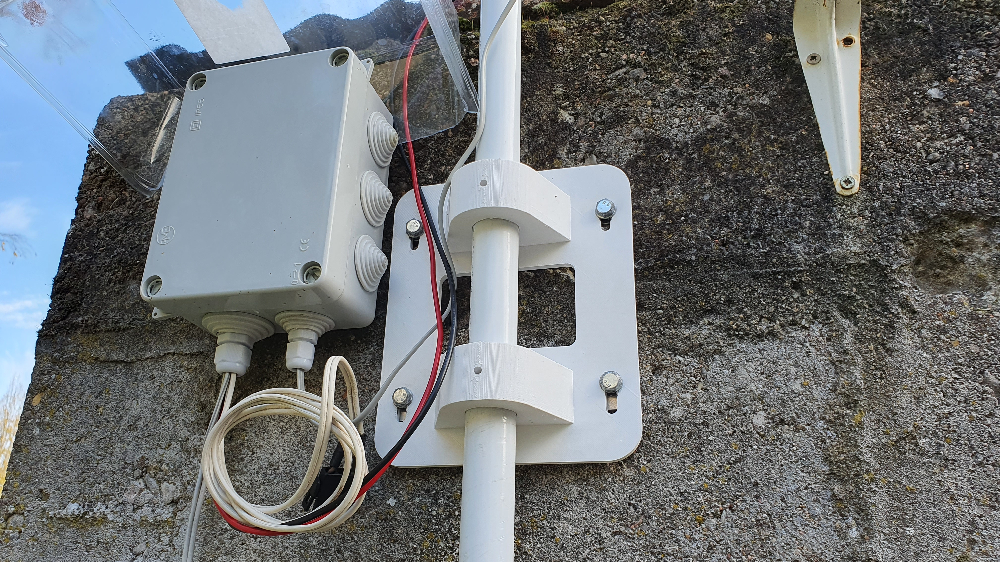

# ESPHome Weather Station

Read this in other language: [English](README.md)


## Introduction

La partie électronique de cette station météo est basée sur le modèle décrit dans un article du magazine Elektor publié en mai 2020 intitulé [Station météo en réseau ouvert V.2](https://www.elektormagazine.fr/magazine/elektor-148/58640) (une évolution de ESP32 Weather Station décrit dans un article du même magazine en janvier 2019).

L'article détaille la création d'une station météo basé sur un ensemble de capteurs référencé WH-SP-WS02 ([Datasheet](docs/Weather_Sensor_Assembly_Updated.pdf)) dont l'électronique d'origine est retirée pour être remplacée par une carte fille capteurs relayant les informations à une carte mère architecturée autour d'un ESP32 (ESP32 Pico Kit).

Un micrologiciel OpenSource [GitHub - ElektorLabs/191148-RemakeWeatherStation: RemakeWeatherStation](https://github.com/ElektorLabs/191148-RemakeWeatherStation) est disponible et permet de faire fonctionner le tout. Malheureusement, je n'ai pas trouvé mon bonheur avec, il n'est pas encore assez abouti et souffre de quelques lacunes qui le rendent très difficilement utilisable tel quel.

J'ai donc décidé d'utiliser ESPHome comme remplacement du programme d'origine afin de simplifier le développement de fonctionnalité mais surtout étendre grandement ses capacités.

La carte détaillée dans l'article d'Elektor se limite finalement à un convertisseur de tension et une adaptation de tension 5V/3V pour l'ESP32.

Il est donc assez simple de recréer cette station météo indépendamment du PCB d'Elektor. Pour les connexions, basez-vous sur les données inclues dans le fichier YAML.

Avec l'aimable [autorisation d'Elektor](https://www.elektormagazine.com/labs/remake-elektor-weather-station#comment-70057), les schémas de principe sont disponibles ici : [Schémas de principe](schematics/).



### Inspirations

* [Station météo en réseau ouvert V.2 | Elektor Magazine](https://www.elektormagazine.fr/magazine/elektor-148/58640)
* [Remake Elektor weather station | Elektor Magazine](https://www.elektormagazine.com/labs/remake-elektor-weather-station)
* [GitHub - mkuoppa/esphomeweatherstation: ESPHome based weatherstation station](https://github.com/mkuoppa/esphomeweatherstation)
* [ESP8266 Weather Station - with Wind and Rain Sensors | Tysonpower.de](https://tysonpower.de/blog/esp8266-weather-station)

## Caractéristiques

* Mesure de la température / humidité relative / pression atmosphérique
* Vitesse / Direction du vent
* Précipitations journalière / par minute
* Luminosité ambiante
* Tension d'entrée
* Panneau solaire:
  * Tension
  * Courant
  * Puissance
  * Puissance accumulée journalière
* Led de statut RGB à base de WS2812
* Toutes les fonctions utilisables avec ESPHome
  * MQTT
  * OTA (Over The Air updates)
  * [La liste est longue](https://esphome.io/)

Note: Sur la photo globale de la station météo, on aperçoit au sommet un boitier, il s'agit d'un module de détection de [la pluie indépendant](https://github.com/hugokernel/esphome-rain-detector).

## Installation

Afin d'installer le firmware sur l'ESP32, je vous invite à suivre la démarche décrite sur le site d'ESPHome: [Getting Started with ESPHome](https://esphome.io/guides/getting_started_command_line.html)

## Électronique

La carte électronique d'Elektor est à utiliser tel quel ou, au vu de sa simplicité, à reproduire sur une platine d'essai.

La publication d'Elektor est erronée, en effet, ils utilisent les GPIO 34 (vitesse du vent) et 38 (mesure de précipitation) directement sans résistance de tirage (`pullup`),
de plus, ces entrées / sorties n'intégrent pas de résistance de tirage, **il faut donc ajouter une résistance de tirage (~10kOhms) sur GPIO34 et GPIO38**.

## Mécanique

Pour le mat, j'ai utilisé un tube de PVC renforcé en métal que vous pouvez trouver dans tout magasin de bricolage au rayon plomberie. Afin de fixer ce dernier sur un mûr, j'ai modélisé sur OpenSCAD [une pièce](wall_pipe_support.scad) que j'ai par la suite imprimé en PETG.

On aperçoit ici la pièce imprimée à côté du boitier contenant le régulateur de charger pour panneau solaire:



## Alimentation

Un des défauts que je reproche à la carte originale d'Elektor, c'est d'avoir lié la technologie de la source de courant à la carte mère (en l'occurence la batterie au plomb), en effet, un [MAX8212](docs/MAX8211-MAX8212.pdf) utilisé avec quelques composants périphériques permet de couper l'alimentation lorsque celle-ci passe en dessous d'un seuil défini par la valeur de 3 résistances. Ce seuil à été choisi afin de protéger une batterie au plomb.

Dans la mesure ou une station météo est censé rester allumée en permanence, je ne comprend pas vraiment le choix ci-dessus car:

* On utilise un panneau solaire afin d'assurer la charge de la batterie mais dans ce cas, nous sommes obligé d'utiliser un régulateur de charge qui assure également la protection de la batterie et donc le circuit de protection intégré est redondant et peut même poser problême.
* On branche la station sur une source de courant illimitée (secteur via un régulateur) et dans ce cas, le circuit de protection ne sert à rien.

Dans les 2 cas mentionnés ci-dessus, on introduit un lien fort sur la carte mère avec la technologie de la batterie, ce qui devrait être fait, AMHA, sur une carte / module indépendant.

Pour ma part, j'ai choisi d'alimenter ma station météo via un [panneau solaire de 30W](https://www.amazon.fr/gp/product/B07MZKLS4Z/ref=as_li_tl?ie=UTF8&camp=1642&creative=6746&creativeASIN=B07MZKLS4Z&linkCode=as2&tag=digita049-21&linkId=f280ba939aba379ee4586d3211f88c44) et un [contrôleur de charge relativement basique](https://www.amazon.fr/gp/product/B07K57WZVP/ref=as_li_tl?ie=UTF8&camp=1642&creative=6746&creativeASIN=B07K57WZVP&linkCode=as2&tag=digita049-21&linkId=d3af4f9616f8d0f0eea5031ee318a9b9).

Si vous utilisez la carte mère d'Elektor avec un module de régulation de charge indépendant, n'oubliez pas d'abaisser le seuil de coupure du MAX8212.

En sortie du panneau solaire, le circuit [INA219](docs/ina219.pdf) permet de mesurer la puissance générée par ce dernier. J'ai d'ailleurs prévu de le remplacer par un [INA3221](docs/ina3221.pdf) afin de pouvoir mesurer également la consommation totale de la station météo et m'aider à affiner la consommation globale (un RFLink avec [OpenMQTTGateway](https://github.com/1technophile/OpenMQTTGateway) et un second kit ESP32 est branché sur la station).

J'utilise une batterie au plomb de 7A récupérée d'un onduleur.

Pour dimensionner le tout, je vous recommande l'outil [BatteryStuff Tools](https://www.batterystuff.com/kb/tools/solar-calculator.html) qui est très pratique.

Actuellement, je ne peux pas dire avoir réussi à rendre ma station météo totalement indépendante énergétiquement parlant à cause d'une mauvaise exposition de mon panneau solaire et d'une consommation trop forte d'un module annexe (module de détection de pluie).

## Explications

### Mesure de température / humidité / pression atmosphérique

Ces 3 grandeurs sont mesurées par un capteur Bosch BME280 et sa configuration dans ESPHome est la suivante:

```yaml
  - platform: bme280
    address: 0x76
    update_interval: 60s
    iir_filter: 16x
    temperature:
      name: "${friendly_name} temperature"
      oversampling: 16x
    humidity:
      name: "${friendly_name} humidity"
      oversampling: 16x
    pressure:
      name: "${friendly_name} pressure"
      oversampling: 16x
```

Le capteur est à mettre à l'intérieur du boitier contenant l'électronique d'origine des capteurs.

Initialement, j'avais également inclu un capteur AM2320 afin de comparer les valeurs des capteurs avec la configuration suivante:

```yaml
  - platform: am2320
    setup_priority: -100
    temperature:
      id: am2320_temperature
      name: "${friendly_name} AM2320 temperature"
    humidity:
      id: am2320_humidity
      name: "${friendly_name} AM2320 humidity"
    update_interval: 60s
```

Les températures et humidités des capteurs étaient moyennées avant d'être envoyé à Home Assistant (voir ci-dessous), il était bien entendu possible d'accéder aux données de chaque capteurs.

```yaml
  - platform: template
    name: "${friendly_name} temperature"
    icon: "mdi:thermometer"
    unit_of_measurement: "°C"
    lambda: |-
      return (
        id(bme280_temperature).state
        +
        id(am2320_temperature).state
      ) / 2;

  - platform: template
    name: "${friendly_name} humidity"
    icon: "mdi:water-percent"
    unit_of_measurement: "%"
    lambda: |-
      return (
        id(bme280_humidity).state
        +
        id(am2320_humidity).state
      ) / 2;
```

En conclution de mes tests, le capteur BME280 est plus fiable et plus précis que le capteur AM2320.

### Mesures relatives au vent

#### Vitesse

La capteur de mesure de vitesse du vent est relié à l'entrée générale 34.
La plateforme ESPHome pulse_counter est utilisé pour réaliser la mesure.

```yaml
  - platform: pulse_counter
    pin:
      number: GPIO34
      mode: INPUT_PULLUP
    unit_of_measurement: 'm/s'
    name: "${friendly_name} wind speed"
    icon: 'mdi:weather-windy'
    count_mode:
      rising_edge: DISABLE
      falling_edge: INCREMENT
    internal_filter: 13us
    update_interval: 60s
    # rotations_per_sec = pulses / 2 / 60
    # circ_m = 0.09 * 2 * 3.14 = 0.5652
    # mps = 1.18 * circ_m * rotations_per_sec
    # mps = 1.18 * 0.5652 / 2 / 60 = 0,0055578
    filters:
      - multiply: 0.0055578
```

#### Direction

La direction du vent est faite dans le capteur à l'aide d'aimant (switch reed) qui commute des résistances. Selon la valeur finale, on en déduit la direction.

Un exemple de la configuration ESPHome:

```yaml
  - platform: resistance
    sensor: source_sensor
    id: resistance_sensor
    configuration: DOWNSTREAM
    resistor: 10kOhm
    internal: true
    name: Resistance Sensor
    reference_voltage: 3.9V
    accuracy_decimals: 1
    filters:
      - median:
          window_size: 7
          send_every: 4
          send_first_at: 3
    on_value:
      - if:
          condition:
            sensor.in_range:
              id: resistance_sensor
              above: 15000
              below: 15500
          then:
            - text_sensor.template.publish:
                id: wind_dir_card
                state: "N"
            - sensor.template.publish:
                id: wind_heading
                state: 0.0
[...]
```

#### Pluie

La mesure des précipitations est réalisée par un système de balancier composé de 2 coupelles, l'eau ruisselle dans l'entonnoir du capteur et rempli la coupelle haute, une fois cette dernière remplie, elle bascule par gravité. Ce mouvement est détecté par un capteur magnétique (reed switch) et une impulsion est générée.
La documentation du capteur indique que chaque impulsion correspond à 0.2794mm de précipitation.

```yaml
  - platform: pulse_counter
    pin:
      number: GPIO38
      mode: INPUT_PULLUP
    unit_of_measurement: 'mm'
    name: "${friendly_name} rain gauge"
    icon: 'mdi:weather-rainy'
    id: rain_gauge
    internal: true
    count_mode:
      rising_edge: DISABLE
      falling_edge: INCREMENT
    internal_filter: 13us
    update_interval: 60s
    filters:
      # Each 0.011" (0.2794mm) of rain causes one momentary contact closure
      - multiply: 0.2794
    accuracy_decimals: 4
```

Afin d'avoir des informations plus pertinentes, on convertie ces mesures en précipitations par minute et on calcul le cumul journalier.

```yaml
  - platform: integration
    name: "${friendly_name} rainfall per min"
    id: rain_per_min
    time_unit: min
    unit_of_measurement: 'mm'
    icon: 'mdi:weather-rainy'
    sensor: rain_gauge

  - platform: total_daily_energy
    name: "${friendly_name} total daily rain"
    power_id: rain_gauge
    unit_of_measurement: 'mm'
    icon: 'mdi:weather-rainy'
    # x60 To convert to aggregated rain amount
    filters:
      - multiply: 60
```

#### Luminosité

Pensez à positionner la capteur de luminosité le plus haut possible sur votre station météo afin qu'il ne subisse pas l'ombre du mat ou d'une partie de la station météo.

```yaml
  - platform: tsl2561
    id: lux_meter
    name: "${friendly_name} ambient Light"
    address: 0x39
    update_interval: 5s
    integration_time: 14ms
    gain: 1x
```

## Fichiers

* weatherstation.yaml: Le fichier de configuration ESPHome
* network.yaml: Les informations de votre réseau
* secrets.yaml: Les informations secrètes relatives à votre réseau
* wall_pipe_support.scad: Le fichier OpenSCAD pour le support de mat
